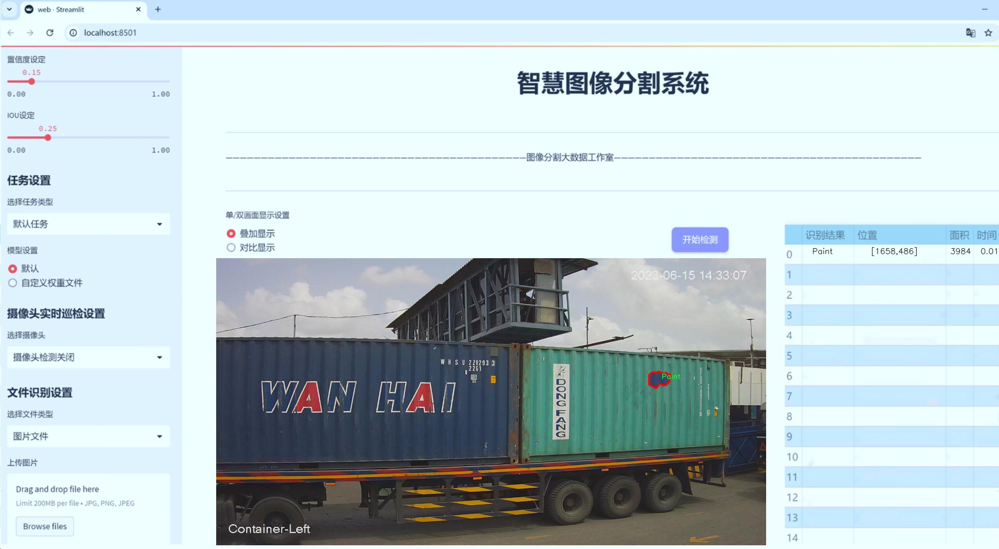
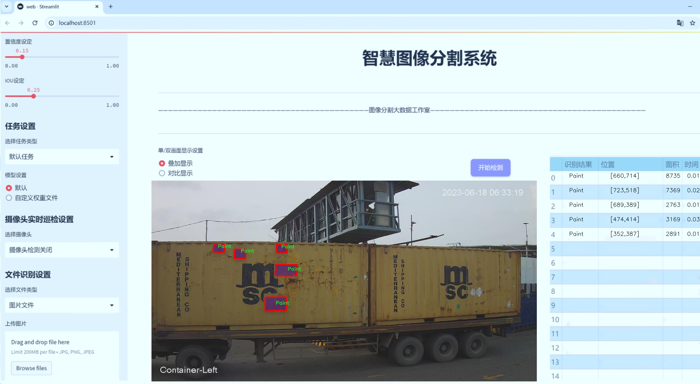
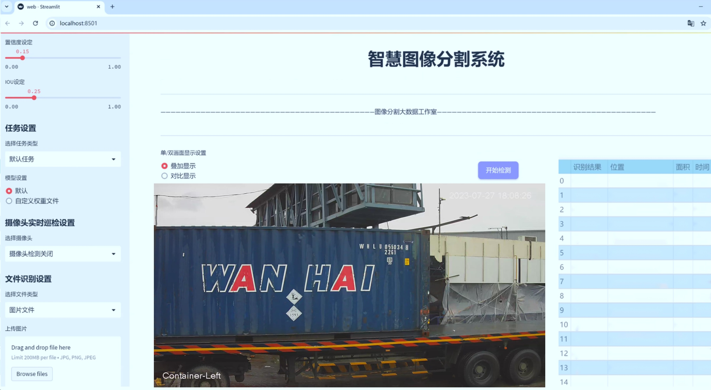
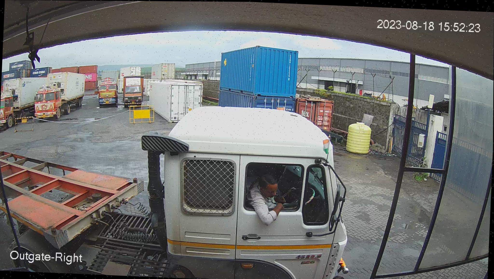
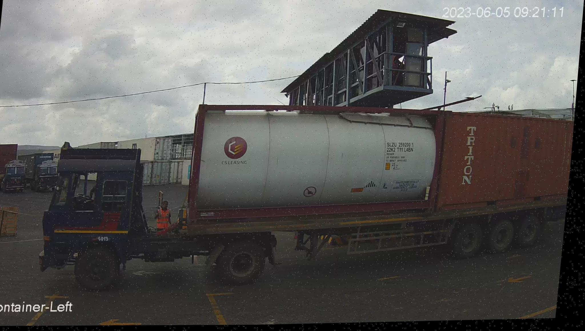
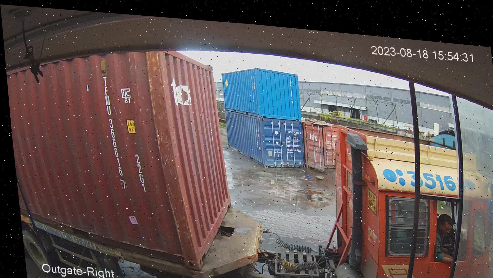
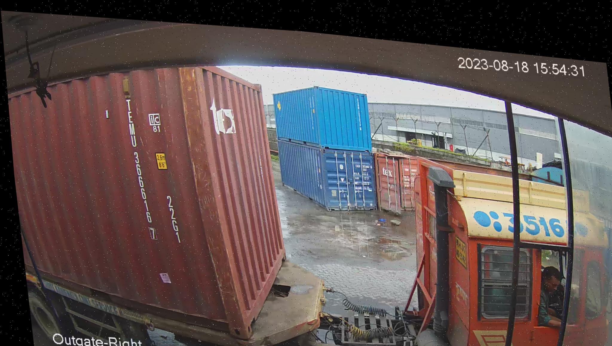
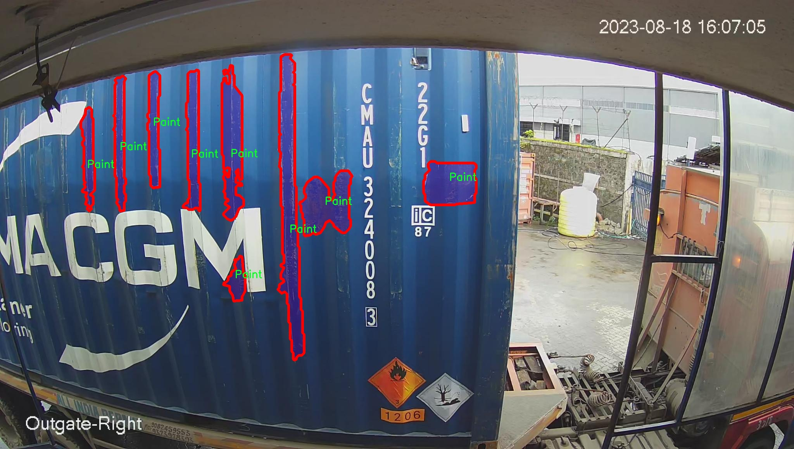

# 运输车辆容器损伤检测图像分割系统： yolov8-seg-aux

### 1.研究背景与意义

[参考博客](https://gitee.com/YOLOv8_YOLOv11_Segmentation_Studio/projects)

[博客来源](https://kdocs.cn/l/cszuIiCKVNis)

研究背景与意义

随着全球贸易的不断发展，运输车辆在货物运输中的重要性日益凸显。然而，运输过程中，容器的损伤问题却频繁发生，给物流行业带来了巨大的经济损失和安全隐患。容器的损伤不仅可能导致货物的丢失或损坏，还可能影响运输的安全性，甚至引发环境污染等一系列问题。因此，及时、准确地检测和评估运输车辆容器的损伤情况，成为了物流管理和安全保障中的一项重要任务。

传统的容器损伤检测方法主要依赖人工检查，这种方法不仅效率低下，而且容易受到人为因素的影响，导致漏检或误检的情况发生。随着计算机视觉技术的迅速发展，基于深度学习的图像处理方法逐渐成为损伤检测领域的研究热点。YOLO（You Only Look Once）系列模型因其高效的实时检测能力和较高的准确率，已被广泛应用于目标检测任务中。特别是YOLOv8作为该系列的最新版本，其在模型结构和性能上都进行了显著的改进，能够更好地适应复杂环境下的目标检测需求。

本研究旨在基于改进的YOLOv8模型，构建一个高效的运输车辆容器损伤检测图像分割系统。该系统将利用包含1100幅图像的损伤检测数据集，涵盖了四个主要类别：容器、凹陷、油漆损伤和锈蚀。这些类别的划分不仅能够帮助我们更细致地识别不同类型的损伤，还能够为后续的损伤评估和修复提供重要依据。通过对图像进行实例分割，我们可以实现对每个损伤区域的精确定位，从而提高检测的准确性和可靠性。

在研究意义上，本项目不仅能够提升运输车辆容器损伤检测的自动化水平，降低人工检查的成本和风险，还能够为物流行业提供更为科学的管理决策依据。通过实时监测和评估容器的损伤情况，企业可以及时采取相应的维护和修复措施，减少因损伤导致的经济损失。同时，该系统的应用也将推动智能物流的发展，提升整体运输效率和安全性。

此外，本研究还将为深度学习在图像分割领域的应用提供新的思路和方法。通过对YOLOv8模型的改进与优化，我们期望能够在提高检测精度的同时，保持较高的处理速度，为实际应用提供更加便捷的解决方案。这不仅对运输行业具有重要的现实意义，也为相关领域的研究提供了有价值的参考。

综上所述，基于改进YOLOv8的运输车辆容器损伤检测图像分割系统的研究，不仅能够有效解决当前运输行业面临的损伤检测难题，还将推动相关技术的发展，为实现智能化、自动化的物流管理奠定基础。

### 2.图片演示







注意：本项目提供完整的训练源码数据集和训练教程,由于此博客编辑较早,暂不提供权重文件（best.pt）,需要按照6.训练教程进行训练后实现上图效果。

### 3.视频演示

[3.1 视频演示](https://www.bilibili.com/video/BV1HBB4YjEub/)

### 4.数据集信息

##### 4.1 数据集类别数＆类别名

nc: 3
names: ['Dent', 'Paint', 'Rust']


##### 4.2 数据集信息简介

数据集信息展示

在现代运输行业中，运输车辆的容器损伤检测变得愈发重要。为了提高损伤检测的准确性和效率，我们构建了一个名为“damagedetection”的数据集，旨在为改进YOLOv8-seg的图像分割系统提供高质量的训练数据。该数据集专注于三种主要的损伤类型：凹陷（Dent）、涂层损坏（Paint）和锈蚀（Rust），通过这些类别的细致划分，旨在提升模型在实际应用中的表现。

“damagedetection”数据集包含了大量的运输车辆容器图像，这些图像均经过精心挑选和标注，以确保其在多样性和代表性方面的广泛性。每个类别的图像都涵盖了不同的角度、光照条件和背景环境，确保模型能够在各种实际场景中进行有效的损伤检测。数据集中的凹陷类别主要包括车辆容器表面因碰撞或挤压造成的凹陷，这类损伤通常会影响容器的结构完整性，因此在检测时需要特别关注。涂层损坏类别则包括因环境因素或化学腐蚀导致的涂层剥落、褪色等现象，这些损伤不仅影响容器的外观，还可能导致进一步的腐蚀和损坏。锈蚀类别则专注于金属表面因长时间暴露于潮湿环境中而产生的锈迹，这种损伤的检测对于延长容器的使用寿命至关重要。

为了确保数据集的有效性，我们采用了多种数据增强技术，如旋转、缩放、裁剪和颜色变换等，以增加数据的多样性并提高模型的鲁棒性。此外，数据集中的每一张图像都附有详细的标注信息，包括损伤类型的具体位置和范围，这为模型的训练提供了准确的监督信号。通过这种方式，我们希望能够训练出一个高效的图像分割模型，使其能够在实际应用中快速、准确地识别和分割出运输车辆容器上的各种损伤。

在构建“damagedetection”数据集的过程中，我们还特别注重数据的平衡性，确保每个类别的样本数量相对均衡，以避免模型在训练过程中出现偏向某一类别的现象。这种平衡不仅有助于提高模型的整体性能，还能增强其在面对不同损伤类型时的适应能力。

总之，“damagedetection”数据集的构建为改进YOLOv8-seg的运输车辆容器损伤检测图像分割系统提供了坚实的基础。通过对凹陷、涂层损坏和锈蚀三种损伤类型的细致标注和丰富的样本数据，我们期望该数据集能够在实际应用中发挥重要作用，帮助运输行业更好地管理和维护车辆容器的安全性与可靠性。随着数据集的不断完善和模型的持续优化，我们相信这一系统将在未来的运输管理中发挥越来越重要的作用。











### 5.项目依赖环境部署教程（零基础手把手教学）

[5.1 环境部署教程链接（零基础手把手教学）](https://www.bilibili.com/video/BV1jG4Ve4E9t/?vd_source=bc9aec86d164b67a7004b996143742dc)


[5.2 安装Python虚拟环境创建和依赖库安装视频教程链接（零基础手把手教学）](https://www.bilibili.com/video/BV1nA4VeYEze/?vd_source=bc9aec86d164b67a7004b996143742dc)

### 6.手把手YOLOV8-seg训练视频教程（零基础手把手教学）

[6.1 手把手YOLOV8-seg训练视频教程（零基础小白有手就能学会）](https://www.bilibili.com/video/BV1cA4VeYETe/?vd_source=bc9aec86d164b67a7004b996143742dc)


按照上面的训练视频教程链接加载项目提供的数据集，运行train.py即可开始训练



     Epoch   gpu_mem       box       obj       cls    labels  img_size
     1/200     0G   0.01576   0.01955  0.007536        22      1280: 100%|██████████| 849/849 [14:42<00:00,  1.04s/it]
               Class     Images     Labels          P          R     mAP@.5 mAP@.5:.95: 100%|██████████| 213/213 [01:14<00:00,  2.87it/s]
                 all       3395      17314      0.994      0.957      0.0957      0.0843

     Epoch   gpu_mem       box       obj       cls    labels  img_size
     2/200     0G   0.01578   0.01923  0.007006        22      1280: 100%|██████████| 849/849 [14:44<00:00,  1.04s/it]
               Class     Images     Labels          P          R     mAP@.5 mAP@.5:.95: 100%|██████████| 213/213 [01:12<00:00,  2.95it/s]
                 all       3395      17314      0.996      0.956      0.0957      0.0845

     Epoch   gpu_mem       box       obj       cls    labels  img_size
     3/200     0G   0.01561    0.0191  0.006895        27      1280: 100%|██████████| 849/849 [10:56<00:00,  1.29it/s]
               Class     Images     Labels          P          R     mAP@.5 mAP@.5:.95: 100%|███████   | 187/213 [00:52<00:00,  4.04it/s]
                 all       3395      17314      0.996      0.957      0.0957      0.0845


### 7.50+种全套YOLOV8-seg创新点加载调参实验视频教程（一键加载写好的改进模型的配置文件）

[7.1 50+种全套YOLOV8-seg创新点加载调参实验视频教程（一键加载写好的改进模型的配置文件）](https://www.bilibili.com/video/BV1Hw4VePEXv/?vd_source=bc9aec86d164b67a7004b996143742dc)

### YOLOV8-seg算法简介

原始YOLOv8-seg算法原理

YOLOv8-seg算法是基于YOLOv8目标检测算法的一个重要扩展，旨在实现目标的精确分割与检测。作为YOLO系列的最新版本，YOLOv8-seg不仅继承了前几代算法的优点，还在网络结构、特征提取、损失函数等多个方面进行了创新和优化。其核心思想是通过引入先进的深度学习技术，提升目标检测和分割的精度与效率，使其在各种应用场景中表现出色。

首先，YOLOv8-seg的网络结构依然遵循YOLO系列的经典设计，主要由输入层、主干网络、特征融合层和解耦头组成。输入层负责将图像数据预处理为适合模型处理的格式，通常将输入图像调整为640x640的RGB格式。主干网络采用了CSPDarknet架构，结合了YOLOv5的C3模块和C2f模块，后者的引入使得网络在保持轻量化的同时，显著提升了特征提取的能力。C2f模块通过引入ELAN思想，采用了多分支结构，能够更有效地捕捉到图像中的细节信息和上下文信息，从而增强了特征的表达能力。

在特征融合层，YOLOv8-seg使用了PAN-FPN结构，这一结构能够有效地融合来自不同层次的特征图，确保网络能够利用多尺度的信息进行目标检测和分割。PAN-FPN通过自下而上的特征融合，结合了高层语义信息和低层细节信息，使得网络在处理复杂场景时能够更准确地识别和分割目标。通过这种特征融合策略，YOLOv8-seg在目标检测任务中展现出了优越的性能，尤其是在处理小目标和复杂背景时。

YOLOv8-seg的另一个显著特点是其采用了Anchor-Free的设计理念，摒弃了传统的Anchor-Base方法。这一转变使得模型在处理目标时更加灵活，能够适应不同形状和大小的目标，减少了对先验框的依赖，从而提高了检测的准确性。此外，YOLOv8-seg在样本匹配策略上也进行了创新，由静态匹配转变为Task-Aligned的Assigner匹配方式，使得模型在训练过程中能够更好地适应不同任务的需求。

在损失函数的设计上，YOLOv8-seg引入了VFLLoss作为分类损失，同时结合DFLLoss和CIoULoss来优化回归任务。这种多损失函数的组合不仅提升了模型的收敛速度，还有效地解决了样本不平衡的问题，尤其是在处理小目标时，能够显著提高模型的检测性能。Focal Loss的引入进一步增强了模型对困难样本的关注，使得YOLOv8-seg在训练过程中能够更好地应对样本不均衡的挑战。

在实际应用中，YOLOv8-seg展现出了极高的灵活性和适应性。通过多尺度训练和测试策略，模型能够在不同的场景下保持高效的检测和分割性能。这使得YOLOv8-seg不仅适用于智能监控、自动驾驶等传统领域，还能够广泛应用于医疗影像分析、工业检测等新兴领域。其高精度和快速响应的特点，使得YOLOv8-seg在实时目标检测和分割任务中成为了一个极具竞争力的选择。

总的来说，YOLOv8-seg算法通过对YOLOv8的深入优化与扩展，成功实现了目标检测与分割的有机结合。其创新的网络结构、灵活的特征融合策略以及高效的损失函数设计，使得YOLOv8-seg在目标检测领域树立了新的标杆。随着深度学习技术的不断发展，YOLOv8-seg有望在更多实际应用中发挥重要作用，为各类智能系统提供强大的视觉识别能力。


### 9.系统功能展示（检测对象为举例，实际内容以本项目数据集为准）

图9.1.系统支持检测结果表格显示

  图9.2.系统支持置信度和IOU阈值手动调节

  图9.3.系统支持自定义加载权重文件best.pt(需要你通过步骤5中训练获得)

  图9.4.系统支持摄像头实时识别

  图9.5.系统支持图片识别

  图9.6.系统支持视频识别

  图9.7.系统支持识别结果文件自动保存

  图9.8.系统支持Excel导出检测结果数据


### 10.50+种全套YOLOV8-seg创新点原理讲解（非科班也可以轻松写刊发刊，V11版本正在科研待更新）

#### 10.1 由于篇幅限制，每个创新点的具体原理讲解就不一一展开，具体见下列网址中的创新点对应子项目的技术原理博客网址【Blog】：


[10.1 50+种全套YOLOV8-seg创新点原理讲解链接](https://gitee.com/qunmasj/good)

#### 10.2 部分改进模块原理讲解(完整的改进原理见上图和技术博客链接)【如果此小节的图加载失败可以通过CSDN或者Github搜索该博客的标题访问原始博客，原始博客图片显示正常】
### CBAM空间注意力机制
近年来，随着深度学习研究方向的火热，注意力机制也被广泛地应用在图像识别、语音识别和自然语言处理等领域，注意力机制在深度学习任务中发挥着举足轻重的作用。注意力机制借鉴于人类的视觉系统，例如，人眼在看到一幅画面时，会倾向于关注画面中的重要信息，而忽略其他可见的信息。深度学习中的注意力机制和人类视觉的注意力机制相似，通过扫描全局数据，从大量数据中选择出需要重点关注的、对当前任务更为重要的信息，然后对这部分信息分配更多的注意力资源，从这些信息中获取更多所需要的细节信息，而抑制其他无用的信息。而在深度学习中，则具体表现为给感兴趣的区域更高的权重，经过网络的学习和调整，得到最优的权重分配，形成网络模型的注意力，使网络拥有更强的学习能力，加快网络的收敛速度。
注意力机制通常可分为软注意力机制和硬注意力机制[4-5]。软注意力机制在选择信息时，不是从输入的信息中只选择1个，而会用到所有输入信息，只是各个信息对应的权重分配不同，然后输入网络模型进行计算;硬注意力机制则是从输入的信息中随机选取一个或者选择概率最高的信息，但是这一步骤通常是不可微的，导致硬注意力机制更难训练。因此，软注意力机制应用更为广泛，按照原理可将软注意力机制划分为:通道注意力机制（channel attention)、空间注意力机制(spatial attention）和混合域注意力机制(mixed attention)。
通道注意力机制的本质建立各个特征通道之间的重要程度，对感兴趣的通道进行重点关注，弱化不感兴趣的通道的作用;空间注意力的本质则是建模了整个空间信息的重要程度，然后对空间内感兴趣的区域进行重点关注，弱化其余非感兴趣区域的作用;混合注意力同时运用了通道注意力和空间注意力，两部分先后进行或并行，形成对通道特征和空间特征同时关注的注意力模型。

卷积层注意力模块(Convolutional Block Attention Module，CBAM）是比较常用的混合注意力模块，其先后集中了通道注意力模块和空间注意力模块，网络中加入该模块能有效提高网络性能，减少网络模型的计算量，模块结构如图所示。输入特征图首先经过分支的通道注意力模块，然后和主干的原特征图融合，得到具有通道注意力的特征图，接着经过分支的空间注意力模块，在和主干的特征图融合后，得到同时具有通道特征注意力和空间特征注意力的特征图。CBAM模块不改变输入特征图的大小，因此该模块是一个“即插即用”的模块，可以插入网络的任何位置。

通道注意力模块的结构示意图如图所示，通道注意力模块分支并行地对输入的特征图进行最大池化操作和平均池化操作，然后利用多层感知机对结果进行变换，得到应用于两个通道的变换结果，最后经过sigmoid激活函数将变换结果融合，得到具有通道注意力的通道特征图。

空间注意力模块示意图如图所示，将通道注意力模块输出的特征图作为该模块的输入特征图，首先对输入特征图进行基于通道的最大池化操作和平均池化操作，将两部分得到的结果拼接起来，然后通过卷积得到降为Ⅰ通道的特征图，最后通过sigmoid激活函数生成具有空间注意力的特征图。


### 11.项目核心源码讲解（再也不用担心看不懂代码逻辑）

#### 11.1 ultralytics\models\nas\predict.py

以下是经过简化和注释的核心代码部分：

```python
# 导入必要的库
import torch
from ultralytics.engine.predictor import BasePredictor
from ultralytics.engine.results import Results
from ultralytics.utils import ops

class NASPredictor(BasePredictor):
    """
    Ultralytics YOLO NAS 预测器，用于目标检测。

    该类扩展了 Ultralytics 引擎中的 `BasePredictor`，负责对 YOLO NAS 模型生成的原始预测结果进行后处理。
    包括非极大值抑制（NMS）和将边界框缩放到原始图像尺寸等操作。

    属性:
        args (Namespace): 包含各种后处理配置的命名空间。
    """

    def postprocess(self, preds_in, img, orig_imgs):
        """对预测结果进行后处理，并返回结果对象列表。"""

        # 将预测框从 xyxy 格式转换为 xywh 格式，并拼接类分数
        boxes = ops.xyxy2xywh(preds_in[0][0])  # 提取边界框
        preds = torch.cat((boxes, preds_in[0][1]), -1).permute(0, 2, 1)  # 合并边界框和分数

        # 应用非极大值抑制，过滤掉冗余的检测框
        preds = ops.non_max_suppression(preds,
                                        self.args.conf,  # 置信度阈值
                                        self.args.iou,   # IOU 阈值
                                        agnostic=self.args.agnostic_nms,  # 是否进行类别无关的 NMS
                                        max_det=self.args.max_det,  # 最大检测框数量
                                        classes=self.args.classes)  # 指定的类别

        # 如果输入图像不是列表，则将其转换为 numpy 数组
        if not isinstance(orig_imgs, list):
            orig_imgs = ops.convert_torch2numpy_batch(orig_imgs)

        results = []  # 存储结果的列表
        for i, pred in enumerate(preds):  # 遍历每个预测结果
            orig_img = orig_imgs[i]  # 获取原始图像
            # 将预测框缩放到原始图像的尺寸
            pred[:, :4] = ops.scale_boxes(img.shape[2:], pred[:, :4], orig_img.shape)
            img_path = self.batch[0][i]  # 获取图像路径
            # 创建结果对象并添加到结果列表中
            results.append(Results(orig_img, path=img_path, names=self.model.names, boxes=pred))
        
        return results  # 返回处理后的结果列表
```

### 代码核心部分说明：
1. **类定义**：`NASPredictor` 继承自 `BasePredictor`，用于处理 YOLO NAS 模型的预测结果。
2. **postprocess 方法**：该方法负责对模型的原始预测结果进行后处理，包括：
   - 将边界框格式转换为适合后续处理的格式。
   - 应用非极大值抑制（NMS）来去除重叠的框。
   - 将预测框缩放到原始图像的尺寸。
   - 将处理后的结果封装成 `Results` 对象，方便后续使用。

这个文件是Ultralytics YOLO（You Only Look Once）模型的一部分，专门用于对象检测的预测处理。文件中定义了一个名为`NASPredictor`的类，它继承自`BasePredictor`，并负责对YOLO NAS模型生成的原始预测结果进行后处理。

在这个类中，`postprocess`方法是核心功能。它接收三个参数：`preds_in`（原始预测结果）、`img`（输入图像）和`orig_imgs`（原始图像）。首先，该方法将原始预测结果中的边界框坐标转换为YOLO格式（xyxy转为xywh），并将边界框与相应的类别分数合并。接着，使用非极大值抑制（NMS）算法来过滤掉重叠的边界框，保留置信度高的检测结果。

在处理完预测结果后，方法会检查输入的原始图像是否为列表格式。如果不是，则将其转换为NumPy数组格式。随后，方法会遍历每个预测结果，并根据输入图像的尺寸对边界框进行缩放，以适应原始图像的尺寸。最后，将每个预测结果封装成`Results`对象，并返回一个包含所有结果的列表。

需要注意的是，这个类通常不会被直接实例化，而是在`NAS`类内部使用。整体来看，这个文件的功能是将YOLO NAS模型的原始输出转化为可用的检测结果，方便后续的应用和分析。

#### 11.2 ultralytics\utils\downloads.py

以下是代码中最核心的部分，并附上详细的中文注释：

```python
import requests
from pathlib import Path
from zipfile import ZipFile, is_zipfile
from tqdm import tqdm  # 进度条库

def safe_download(url, file=None, dir=None, unzip=True, delete=False, retry=3, progress=True):
    """
    从指定的 URL 下载文件，并可选择解压和删除下载的文件。

    参数:
        url (str): 要下载的文件的 URL。
        file (str, optional): 下载文件的文件名。如果未提供，将使用 URL 的文件名。
        dir (str, optional): 保存下载文件的目录。如果未提供，将使用当前工作目录。
        unzip (bool, optional): 是否解压下载的文件。默认值为 True。
        delete (bool, optional): 是否在解压后删除下载的文件。默认值为 False。
        retry (int, optional): 下载失败时的重试次数。默认值为 3。
        progress (bool, optional): 是否在下载过程中显示进度条。默认值为 True。
    """
    # 确定文件保存路径
    f = Path(dir) / (file if file else url.split('/')[-1])  # 如果没有提供文件名，则从 URL 中提取

    # 如果文件不存在，则开始下载
    if not f.is_file():
        for i in range(retry + 1):
            try:
                # 使用 requests 下载文件
                with requests.get(url, stream=True) as response:
                    response.raise_for_status()  # 检查请求是否成功
                    total_size = int(response.headers.get('content-length', 0))  # 获取文件总大小
                    with open(f, 'wb') as f_opened:
                        # 使用 tqdm 显示下载进度
                        with tqdm(total=total_size, unit='B', unit_scale=True, desc=f'Downloading {f.name}', disable=not progress) as pbar:
                            for data in response.iter_content(chunk_size=8192):  # 分块下载
                                f_opened.write(data)  # 写入文件
                                pbar.update(len(data))  # 更新进度条

                # 下载成功，检查文件大小
                if f.exists() and f.stat().st_size > 0:
                    break  # 下载成功，退出重试循环
            except Exception as e:
                if i >= retry:
                    raise ConnectionError(f'下载失败: {url}') from e  # 超过重试次数，抛出异常

    # 解压文件
    if unzip and f.exists() and f.suffix in ('.zip', '.tar', '.gz'):
        unzip_file(f)  # 调用解压函数

    # 根据需要删除下载的文件
    if delete:
        f.unlink()  # 删除文件

def unzip_file(file):
    """
    解压指定的压缩文件。

    参数:
        file (Path): 要解压的文件路径。
    """
    if is_zipfile(file):
        with ZipFile(file, 'r') as zipObj:
            zipObj.extractall(file.parent)  # 解压到同一目录
```

### 代码核心部分解释：
1. **safe_download 函数**：这是下载文件的主要函数，支持从 URL 下载文件，并提供了重试机制、进度条显示、解压和删除功能。
   - **参数说明**：
     - `url`：要下载的文件的 URL。
     - `file`：指定下载后的文件名。
     - `dir`：指定保存下载文件的目录。
     - `unzip`：下载后是否解压文件。
     - `delete`：解压后是否删除下载的文件。
     - `retry`：下载失败时的重试次数。
     - `progress`：是否显示下载进度条。

2. **unzip_file 函数**：负责解压缩文件，支持 `.zip` 格式的文件。

3. **使用 tqdm 库**：在下载过程中显示进度条，提升用户体验。

4. **异常处理**：在下载过程中，如果发生异常，会进行重试，超过重试次数则抛出异常。

这段代码是一个完整的文件下载和解压缩的实现，具有较好的灵活性和用户友好性。

这个程序文件是一个用于下载和处理文件的工具，主要用于Ultralytics YOLO项目。它包含了一系列函数，帮助用户从网络上下载文件、解压缩文件、检查磁盘空间等。

首先，文件中导入了一些必要的库，包括处理文件路径的`Path`、进行网络请求的`requests`、以及用于多线程下载的`ThreadPool`等。接着，定义了一些与Ultralytics GitHub资源相关的常量，包括模型文件的名称和路径。

`is_url`函数用于检查给定字符串是否为有效的URL，并可选地检查该URL是否存在。`delete_dsstore`函数则专门用于删除macOS系统生成的隐藏文件（如.DS_Store），以避免在文件传输过程中出现问题。

`zip_directory`和`unzip_file`函数分别用于压缩和解压缩目录。压缩时会排除指定的文件，而解压缩时则会处理文件的路径和结构，确保文件正确地提取到目标目录。

`check_disk_space`函数用于检查下载文件所需的磁盘空间是否足够。它会根据文件的大小和一个安全系数来判断是否有足够的空间，如果空间不足，可以选择抛出异常或发出警告。

`get_google_drive_file_info`函数用于从Google Drive的分享链接中提取直接下载链接和文件名，以便后续下载。

`safe_download`函数是核心下载功能，支持从URL下载文件，并可以选择解压缩、删除下载后的文件等。它还支持重试机制，以应对下载失败的情况。

`get_github_assets`和`attempt_download_asset`函数用于从GitHub获取资源，尝试下载特定的文件，如果本地不存在该文件，则从GitHub的发布页面下载。

最后，`download`函数提供了一个简单的接口来下载文件，可以选择使用多线程下载，提升下载效率。

整体来看，这个文件提供了一整套文件下载和处理的工具，适用于需要从网络获取和管理模型文件的场景，尤其是在机器学习和计算机视觉领域。

#### 11.3 log.py

以下是代码中最核心的部分，并附上详细的中文注释：

```python
import os
import time
import cv2
import pandas as pd
from PIL import Image

def save_chinese_image(file_path, image_array):
    """
    保存带有中文路径的图片文件

    参数：
    file_path (str): 图片的保存路径，应包含中文字符, 例如 '示例路径/含有中文的文件名.png'
    image_array (numpy.ndarray): 要保存的 OpenCV 图像（即 numpy 数组）
    """
    try:
        # 将 OpenCV 图片转换为 Pillow Image 对象
        image = Image.fromarray(cv2.cvtColor(image_array, cv2.COLOR_BGR2RGB))

        # 使用 Pillow 保存图片文件
        image.save(file_path)

        print(f"成功保存图像到: {file_path}")
    except Exception as e:
        print(f"保存图像失败: {str(e)}")

class LogTable:
    def __init__(self, csv_file_path=None):
        """
        初始化类实例。

        参数：
        csv_file_path (str): 保存初始数据的CSV文件路径。
        """
        self.csv_file_path = csv_file_path
        self.data = pd.DataFrame(columns=['文件路径', '识别结果', '位置', '面积', '时间'])

        # 尝试从CSV文件加载数据，如果失败则创建一个空的DataFrame
        if csv_file_path and os.path.exists(csv_file_path):
            self.data = pd.read_csv(csv_file_path, encoding='utf-8')

    def add_log_entry(self, file_path, recognition_result, position, confidence, time_spent):
        """
        向日志中添加一条新记录。

        参数：
        file_path (str): 文件路径
        recognition_result (str): 识别结果
        position (str): 位置
        confidence (float): 置信度
        time_spent (float): 用时（通常是秒或毫秒）

        返回：
        None
        """
        # 创建新的数据行
        new_entry = pd.DataFrame([[file_path, recognition_result, position, confidence, time_spent]],
                                 columns=['文件路径', '识别结果', '位置', '面积', '时间'])

        # 将新行添加到DataFrame中
        self.data = pd.concat([new_entry, self.data]).reset_index(drop=True)

    def save_to_csv(self):
        """
        将更新后的DataFrame保存到CSV文件
        """
        self.data.to_csv(self.csv_file_path, index=False, encoding='utf-8', mode='a', header=False)

    def update_table(self, log_table_placeholder):
        """
        更新表格，显示最新的500条记录。

        参数：
        log_table_placeholder: Streamlit的表格占位符

        返回：
        None
        """
        # 判断DataFrame的长度是否超过500
        if len(self.data) > 500:
            # 如果超过500，仅显示最新的500条记录
            display_data = self.data.head(500)
        else:
            # 如果不超过，显示全部数据
            display_data = self.data

        log_table_placeholder.table(display_data)
```

### 代码核心部分说明：

1. **`save_chinese_image` 函数**:
   - 该函数用于保存带有中文路径的图片文件。它接收文件路径和图像数组作为参数，将图像从 OpenCV 格式转换为 Pillow 格式，并保存到指定路径。

2. **`LogTable` 类**:
   - 该类用于管理日志记录，包括初始化、添加日志条目、保存到 CSV 文件以及更新显示表格等功能。
   - **`__init__` 方法**: 初始化时尝试从指定的 CSV 文件加载数据，如果文件不存在则创建一个空的 DataFrame。
   - **`add_log_entry` 方法**: 用于添加新的日志记录，接收文件路径、识别结果、位置、置信度和用时等信息，并将其添加到 DataFrame 中。
   - **`save_to_csv` 方法**: 将当前的 DataFrame 保存到 CSV 文件中。
   - **`update_table` 方法**: 更新表格显示，最多显示最新的 500 条记录。 

以上部分是整个代码的核心功能，主要集中在图像保存和日志记录管理上。

这个程序文件 `log.py` 主要用于处理图像数据和记录识别结果。它包含了图像保存、结果记录和日志管理等功能，适用于图像处理和计算机视觉任务。程序中使用了多个库，包括 OpenCV、Pandas、Pillow 和 NumPy，来实现这些功能。

首先，程序定义了一个 `save_chinese_image` 函数，用于保存带有中文路径的图像文件。该函数接收两个参数：文件路径和图像数组。它尝试将 OpenCV 图像转换为 Pillow 图像对象，并使用 Pillow 的 `save` 方法保存图像。如果保存成功，会打印成功信息；如果失败，则捕获异常并打印错误信息。

接下来，程序定义了一个 `ResultLogger` 类，用于记录检测结果。该类在初始化时创建一个空的 Pandas DataFrame，包含“识别结果”、“位置”、“面积”和“时间”四个列。`concat_results` 方法用于将新的检测结果添加到 DataFrame 中。它接收检测结果、位置、置信度和时间作为参数，并将这些信息封装成一个字典，随后创建一个新的 DataFrame 并与现有的 DataFrame 进行合并。

然后，程序定义了一个 `LogTable` 类，用于管理图像和结果的日志。该类在初始化时可以接收一个 CSV 文件路径，如果该文件不存在，则会创建一个带有初始表头的空 DataFrame。`add_frames` 方法用于添加图像和检测信息到类的属性中。`clear_frames` 方法则用于清空这些属性。

`save_frames_file` 方法用于保存图像或视频。如果保存的图像数量为一，则将其保存为 PNG 文件；如果有多张图像，则将其保存为 AVI 格式的视频。保存的文件名会包含当前的时间戳，以确保唯一性。

`add_log_entry` 方法用于向日志中添加一条新记录，记录的内容包括文件路径、识别结果、位置、置信度和时间。新记录会被添加到 DataFrame 的顶部。`clear_data` 方法则用于清空 DataFrame 中的数据。

`save_to_csv` 方法将更新后的 DataFrame 保存到指定的 CSV 文件中，使用 UTF-8 编码并以追加模式写入。最后，`update_table` 方法用于更新表格，显示最新的 500 条记录，适用于与 Streamlit 等可视化工具结合使用。

总体来说，这个程序文件实现了图像处理和结果记录的基本功能，适合用于需要保存和管理识别结果的计算机视觉应用。

#### 11.4 ultralytics\utils\triton.py

以下是经过简化和注释的核心代码部分：

```python
# 导入必要的库
from typing import List
from urllib.parse import urlsplit
import numpy as np

class TritonRemoteModel:
    """
    与远程Triton推理服务器模型交互的客户端。

    属性:
        endpoint (str): Triton服务器上模型的名称。
        url (str): Triton服务器的URL。
        triton_client: Triton客户端（HTTP或gRPC）。
        InferInput: Triton客户端的输入类。
        InferRequestedOutput: Triton客户端的输出请求类。
        input_formats (List[str]): 模型输入的数据类型。
        np_input_formats (List[type]): 模型输入的numpy数据类型。
        input_names (List[str]): 模型输入的名称。
        output_names (List[str]): 模型输出的名称。
    """

    def __init__(self, url: str, endpoint: str = '', scheme: str = ''):
        """
        初始化TritonRemoteModel。

        参数可以单独提供或从一个集体的'url'参数解析，格式为
            <scheme>://<netloc>/<endpoint>/<task_name>

        参数:
            url (str): Triton服务器的URL。
            endpoint (str): Triton服务器上模型的名称。
            scheme (str): 通信方案（'http'或'grpc'）。
        """
        # 如果没有提供endpoint和scheme，则从URL中解析
        if not endpoint and not scheme:
            splits = urlsplit(url)
            endpoint = splits.path.strip('/').split('/')[0]  # 提取模型名称
            scheme = splits.scheme  # 提取通信方案
            url = splits.netloc  # 提取网络位置

        self.endpoint = endpoint  # 设置模型名称
        self.url = url  # 设置服务器URL

        # 根据通信方案选择Triton客户端
        if scheme == 'http':
            import tritonclient.http as client  # 导入HTTP客户端
            self.triton_client = client.InferenceServerClient(url=self.url, verbose=False, ssl=False)
            config = self.triton_client.get_model_config(endpoint)  # 获取模型配置
        else:
            import tritonclient.grpc as client  # 导入gRPC客户端
            self.triton_client = client.InferenceServerClient(url=self.url, verbose=False, ssl=False)
            config = self.triton_client.get_model_config(endpoint, as_json=True)['config']  # 获取模型配置

        # 按字母顺序排序输出名称
        config['output'] = sorted(config['output'], key=lambda x: x.get('name'))

        # 定义模型属性
        type_map = {'TYPE_FP32': np.float32, 'TYPE_FP16': np.float16, 'TYPE_UINT8': np.uint8}
        self.InferRequestedOutput = client.InferRequestedOutput  # 设置输出请求类
        self.InferInput = client.InferInput  # 设置输入类
        self.input_formats = [x['data_type'] for x in config['input']]  # 获取输入数据类型
        self.np_input_formats = [type_map[x] for x in self.input_formats]  # 获取numpy数据类型
        self.input_names = [x['name'] for x in config['input']]  # 获取输入名称
        self.output_names = [x['name'] for x in config['output']]  # 获取输出名称

    def __call__(self, *inputs: np.ndarray) -> List[np.ndarray]:
        """
        使用给定的输入调用模型。

        参数:
            *inputs (List[np.ndarray]): 输入数据。

        返回:
            List[np.ndarray]: 模型输出。
        """
        infer_inputs = []  # 存储推理输入
        input_format = inputs[0].dtype  # 获取输入数据类型
        for i, x in enumerate(inputs):
            # 如果输入数据类型与模型要求不符，则转换数据类型
            if x.dtype != self.np_input_formats[i]:
                x = x.astype(self.np_input_formats[i])
            # 创建InferInput对象并设置数据
            infer_input = self.InferInput(self.input_names[i], [*x.shape], self.input_formats[i].replace('TYPE_', ''))
            infer_input.set_data_from_numpy(x)  # 从numpy数组设置数据
            infer_inputs.append(infer_input)  # 添加到推理输入列表

        # 创建InferRequestedOutput对象
        infer_outputs = [self.InferRequestedOutput(output_name) for output_name in self.output_names]
        # 调用Triton客户端进行推理
        outputs = self.triton_client.infer(model_name=self.endpoint, inputs=infer_inputs, outputs=infer_outputs)

        # 返回输出结果，转换为原始输入数据类型
        return [outputs.as_numpy(output_name).astype(input_format) for output_name in self.output_names]
```

### 代码说明：
1. **类定义**：`TritonRemoteModel`类用于与Triton推理服务器的模型进行交互。
2. **初始化方法**：`__init__`方法解析输入的URL，设置模型的名称和服务器的URL，并根据通信方案选择相应的Triton客户端。
3. **输入和输出处理**：`__call__`方法接受输入数据，处理数据类型并创建推理请求，最后返回模型的输出结果。

这个程序文件定义了一个名为 `TritonRemoteModel` 的类，用于与远程的 Triton 推理服务器模型进行交互。该类的主要功能是通过 HTTP 或 gRPC 协议与 Triton 服务器进行通信，发送输入数据并接收模型的输出结果。

在类的初始化方法 `__init__` 中，首先接受一个 URL 字符串和可选的模型端点及通信协议。如果没有提供端点和协议，程序会从 URL 中解析出这些信息。接着，根据提供的协议类型（HTTP 或 gRPC），选择相应的 Triton 客户端库，并使用该库连接到 Triton 服务器。

连接成功后，程序会获取指定模型的配置，并对输出名称进行排序，以确保输出的顺序是确定的。模型的输入和输出信息（如数据类型和名称）会被提取并存储为类的属性，以便后续使用。

`__call__` 方法使得该类的实例可以像函数一样被调用。它接受多个 NumPy 数组作为输入，首先检查输入数据的类型是否与模型要求的类型一致，如果不一致，则进行类型转换。然后，程序创建输入对象，并将数据设置到这些对象中。接下来，构建输出请求对象，并通过 Triton 客户端发送推理请求。

最后，程序将返回的输出结果转换为 NumPy 数组，并按照输出名称的顺序返回。这使得用户可以方便地使用该类来进行模型推理，简化了与 Triton 服务器的交互过程。

#### 11.5 ultralytics\models\rtdetr\__init__.py

以下是代码中最核心的部分，并附上详细的中文注释：

```python
# 导入RTDETR模型类
from .model import RTDETR

# 导入RTDETR预测器类
from .predict import RTDETRPredictor

# 导入RTDETR验证器类
from .val import RTDETRValidator

# 定义模块的公开接口，包含RTDETR预测器、验证器和模型
__all__ = 'RTDETRPredictor', 'RTDETRValidator', 'RTDETR'
```

### 代码注释说明：

1. **导入模型、预测器和验证器**：
   - `from .model import RTDETR`：从当前模块的`model`文件中导入`RTDETR`类，这个类通常是用于定义YOLO模型的结构和参数。
   - `from .predict import RTDETRPredictor`：从当前模块的`predict`文件中导入`RTDETRPredictor`类，这个类负责使用RTDETR模型进行预测。
   - `from .val import RTDETRValidator`：从当前模块的`val`文件中导入`RTDETRValidator`类，这个类用于验证模型的性能，通常涉及到模型的评估和结果分析。

2. **定义模块的公开接口**：
   - `__all__ = 'RTDETRPredictor', 'RTDETRValidator', 'RTDETR'`：这个特殊变量`__all__`用于定义当使用`from module import *`时，哪些类或函数会被导入。这里公开了`RTDETRPredictor`、`RTDETRValidator`和`RTDETR`，使得用户可以方便地使用这些核心功能。

这个程序文件是一个Python模块的初始化文件，位于`ultralytics\models\rtdetr`目录下。文件的主要功能是导入和暴露该模块中的关键类和功能，以便其他模块或脚本可以方便地使用。

首先，文件开头的注释部分提到这是Ultralytics YOLO项目的一部分，并且使用了AGPL-3.0许可证。这表明该项目是开源的，并且遵循特定的开源协议。

接下来，文件通过`from .model import RTDETR`导入了`model`模块中的`RTDETR`类。这个类可能是实现某种目标检测算法的核心部分。

然后，文件通过`from .predict import RTDETRPredictor`导入了`predict`模块中的`RTDETRPredictor`类。这个类的名称暗示它可能用于进行目标检测的预测。

接着，文件通过`from .val import RTDETRValidator`导入了`val`模块中的`RTDETRValidator`类。这个类可能用于验证模型的性能，确保其在测试数据集上的准确性和可靠性。

最后，`__all__`变量被定义为一个元组，包含了`RTDETRPredictor`、`RTDETRValidator`和`RTDETR`这三个类的名称。这意味着当使用`from ultralytics.models.rtdetr import *`这样的语句时，只会导入这三个类。这是一种控制模块导出内容的方式，有助于避免命名冲突并提高代码的可读性。

总的来说，这个初始化文件的作用是组织和简化模块的结构，使得用户能够方便地访问和使用RTDETR相关的功能。

### 12.系统整体结构（节选）

### 整体功能和构架概括

该项目是Ultralytics YOLO（You Only Look Once）系列的一个实现，主要用于目标检测和计算机视觉任务。项目的结构清晰，功能模块化，包含多个文件和类，分别负责不同的任务。整体上，项目包括模型的定义、预测、结果记录、文件下载和与远程推理服务器的交互等功能。

- **模型预测**：通过`ultralytics\models\nas\predict.py`文件实现，负责处理模型的预测结果。
- **文件管理**：通过`ultralytics\utils\downloads.py`文件实现，提供下载和处理模型文件的工具。
- **结果记录**：通过`log.py`文件实现，负责记录图像处理和检测结果。
- **远程推理**：通过`ultralytics\utils\triton.py`文件实现，提供与Triton推理服务器的交互功能。
- **模块初始化**：通过`ultralytics\models\rtdetr\__init__.py`文件实现，组织和暴露RTDETR相关的功能。

### 文件功能整理表

| 文件路径                                      | 功能描述                                                         |
|-----------------------------------------------|------------------------------------------------------------------|
| `ultralytics/models/nas/predict.py`          | 处理YOLO NAS模型的预测结果，包括后处理和非极大值抑制。         |
| `ultralytics/utils/downloads.py`             | 提供文件下载和处理工具，包括从网络下载、解压缩和检查磁盘空间。   |
| `log.py`                                      | 记录图像处理和检测结果，支持保存图像、记录日志和管理结果。     |
| `ultralytics/utils/triton.py`                | 提供与远程Triton推理服务器的交互功能，发送输入并接收输出。     |
| `ultralytics/models/rtdetr/__init__.py`     | 初始化RTDETR模块，导入和暴露关键类（如RTDETR、RTDETRPredictor、RTDETRValidator）。 |

这个表格总结了每个文件的主要功能，帮助理解项目的结构和各个模块之间的关系。

### 13.图片、视频、摄像头图像分割Demo(去除WebUI)代码

在这个博客小节中，我们将讨论如何在不使用WebUI的情况下，实现图像分割模型的使用。本项目代码已经优化整合，方便用户将分割功能嵌入自己的项目中。
核心功能包括图片、视频、摄像头图像的分割，ROI区域的轮廓提取、类别分类、周长计算、面积计算、圆度计算以及颜色提取等。
这些功能提供了良好的二次开发基础。

### 核心代码解读

以下是主要代码片段，我们会为每一块代码进行详细的批注解释：

```python
import random
import cv2
import numpy as np
from PIL import ImageFont, ImageDraw, Image
from hashlib import md5
from model import Web_Detector
from chinese_name_list import Label_list

# 根据名称生成颜色
def generate_color_based_on_name(name):
    ......

# 计算多边形面积
def calculate_polygon_area(points):
    return cv2.contourArea(points.astype(np.float32))

...
# 绘制中文标签
def draw_with_chinese(image, text, position, font_size=20, color=(255, 0, 0)):
    image_pil = Image.fromarray(cv2.cvtColor(image, cv2.COLOR_BGR2RGB))
    draw = ImageDraw.Draw(image_pil)
    font = ImageFont.truetype("simsun.ttc", font_size, encoding="unic")
    draw.text(position, text, font=font, fill=color)
    return cv2.cvtColor(np.array(image_pil), cv2.COLOR_RGB2BGR)

# 动态调整参数
def adjust_parameter(image_size, base_size=1000):
    max_size = max(image_size)
    return max_size / base_size

# 绘制检测结果
def draw_detections(image, info, alpha=0.2):
    name, bbox, conf, cls_id, mask = info['class_name'], info['bbox'], info['score'], info['class_id'], info['mask']
    adjust_param = adjust_parameter(image.shape[:2])
    spacing = int(20 * adjust_param)

    if mask is None:
        x1, y1, x2, y2 = bbox
        aim_frame_area = (x2 - x1) * (y2 - y1)
        cv2.rectangle(image, (x1, y1), (x2, y2), color=(0, 0, 255), thickness=int(3 * adjust_param))
        image = draw_with_chinese(image, name, (x1, y1 - int(30 * adjust_param)), font_size=int(35 * adjust_param))
        y_offset = int(50 * adjust_param)  # 类别名称上方绘制，其下方留出空间
    else:
        mask_points = np.concatenate(mask)
        aim_frame_area = calculate_polygon_area(mask_points)
        mask_color = generate_color_based_on_name(name)
        try:
            overlay = image.copy()
            cv2.fillPoly(overlay, [mask_points.astype(np.int32)], mask_color)
            image = cv2.addWeighted(overlay, 0.3, image, 0.7, 0)
            cv2.drawContours(image, [mask_points.astype(np.int32)], -1, (0, 0, 255), thickness=int(8 * adjust_param))

            # 计算面积、周长、圆度
            area = cv2.contourArea(mask_points.astype(np.int32))
            perimeter = cv2.arcLength(mask_points.astype(np.int32), True)
            ......

            # 计算色彩
            mask = np.zeros(image.shape[:2], dtype=np.uint8)
            cv2.drawContours(mask, [mask_points.astype(np.int32)], -1, 255, -1)
            color_points = cv2.findNonZero(mask)
            ......

            # 绘制类别名称
            x, y = np.min(mask_points, axis=0).astype(int)
            image = draw_with_chinese(image, name, (x, y - int(30 * adjust_param)), font_size=int(35 * adjust_param))
            y_offset = int(50 * adjust_param)

            # 绘制面积、周长、圆度和色彩值
            metrics = [("Area", area), ("Perimeter", perimeter), ("Circularity", circularity), ("Color", color_str)]
            for idx, (metric_name, metric_value) in enumerate(metrics):
                ......

    return image, aim_frame_area

# 处理每帧图像
def process_frame(model, image):
    pre_img = model.preprocess(image)
    pred = model.predict(pre_img)
    det = pred[0] if det is not None and len(det)
    if det:
        det_info = model.postprocess(pred)
        for info in det_info:
            image, _ = draw_detections(image, info)
    return image

if __name__ == "__main__":
    cls_name = Label_list
    model = Web_Detector()
    model.load_model("./weights/yolov8s-seg.pt")

    # 摄像头实时处理
    cap = cv2.VideoCapture(0)
    while cap.isOpened():
        ret, frame = cap.read()
        if not ret:
            break
        ......

    # 图片处理
    image_path = './icon/OIP.jpg'
    image = cv2.imread(image_path)
    if image is not None:
        processed_image = process_frame(model, image)
        ......

    # 视频处理
    video_path = ''  # 输入视频的路径
    cap = cv2.VideoCapture(video_path)
    while cap.isOpened():
        ret, frame = cap.read()
        ......
```


### 14.完整训练+Web前端界面+50+种创新点源码、数据集获取


# [下载链接：https://mbd.pub/o/bread/Z5iamJlr](https://mbd.pub/o/bread/Z5iamJlr)